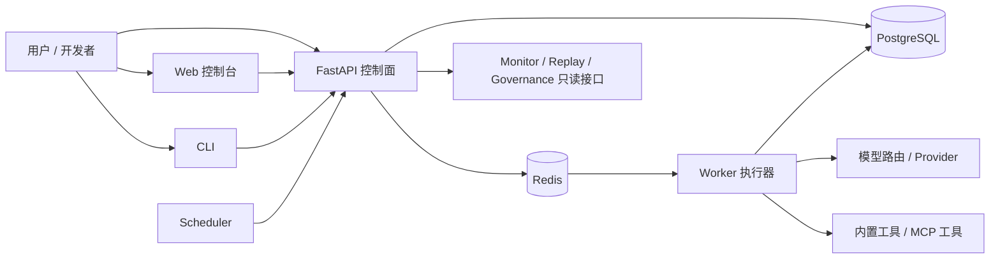
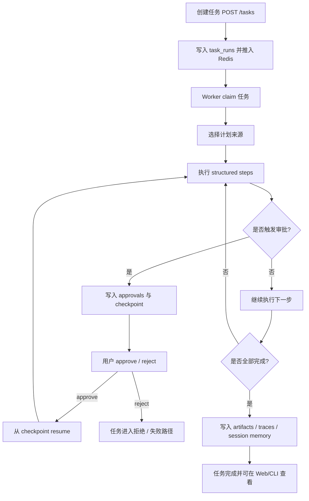
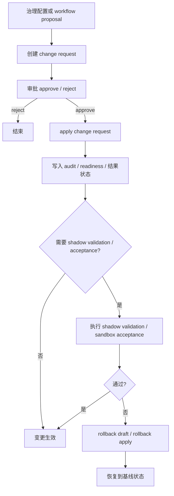

# AI Assistant

一个面向本地运行与持续演进场景的 AI 助理执行平台：支持自然语言任务创建、结构化步骤执行、审批与恢复、会话记忆、治理控制面，以及 Stage 5/6/7 对应的多 Agent、评估提案、受控变更与回滚能力。

## 项目简介

这个仓库从“自然语言任务 -> 规划 -> 工具执行 -> 审批 -> 恢复执行”这条主链出发，逐步演进成一个可运行、可治理、可回放、可持续改进的 AI Assistant 平台。

从当前目录结构和代码实现来看，项目已经不只是一个聊天界面或脚本集合，而是包含以下几个部分：

- 一个基于 FastAPI 的控制面 API；
- 一个独立的 Python Worker，用于执行任务、调用工具、写入 checkpoint 与 traces；
- 一个以单文件静态页面实现的 Web 控制台；
- PostgreSQL + Redis 作为运行状态中心与任务协调基础设施；
- 一组围绕验收、治理、回归和阶段收口的 shell / Python 脚本；
- 一套与当前仓库状态对应的运行文档、收口清单和工程证据文档。

面向对象主要包括：

- 直接使用系统执行任务的项目使用者；
- 需要调试任务主链、治理链和阶段能力的开发者；
- 需要运行、回归、审计、发布该仓库的维护者。

## 项目实现目标

### 该项目要解决的问题

从当前代码可见，本项目主要尝试解决以下问题：

- 把自然语言任务转为可执行的结构化步骤；
- 在任务执行过程中提供审批、重试、checkpoint、interrupt / resume；
- 对工具、模型、权限、配额、风险策略和变更操作进行统一治理；
- 用 session / memory / review 机制让系统具备最小助理化能力；
- 用 traces / replay / evaluator / workflow proposal 支撑可观测、复盘与持续优化；
- 用 change request、shadow validation、rollback 与 sandbox 实验通道，提供受控自修改能力。

### 核心目标

- 提供一个可本地运行的 AI Assistant 控制面与执行面；
- 保持单一状态中心，避免出现第二套任务状态机；
- 把高风险动作纳入审批、审计与治理边界；
- 保证任务执行过程可追踪、可回放、可恢复；
- 为多 Agent、评估、自改进和受控变更提供可验证的工程底座。

### 主要功能范围

根据当前仓库实现，系统主要覆盖以下功能范围：

- 任务创建、任务列表、任务详情、步骤查看、checkpoint 查看；
- 工具调用与结构化步骤执行；
- 审批、拒绝、恢复、打断、重试；
- session、memory、state、review、daily review；
- tool registry、model routes / providers、risk policies、access actors / quotas；
- traces、replay、runtime metadata、monitor overview；
- Stage 5 多 Agent 基础对象与查看能力；
- Stage 6 evaluator / workflow proposal / change request bridge；
- Stage 7 change request apply / rollback、shadow validation、sandbox_file 实验闭环。

### 适用场景

- 本地验证 AI 任务执行平台的主链能力；
- 研究“任务执行 + 治理 + 审批 + 回滚”一体化架构；
- 作为持续演进中的 AI Assistant 平台实验仓库；
- 对多 Agent、评估、自改进、受控配置变更进行工程化验证。

### 预期价值

- 降低从“会回答”到“会执行”的系统搭建门槛；
- 为任务执行平台提供较完整的治理与回滚思路；
- 为后续更强的交付闭环、会话层和长期记忆扩展保留清晰的基础结构。

## 项目架构设计

### 系统整体架构

从 `infra/compose/docker-compose.yml`、`apps/api/main.py`、`apps/worker/worker.py` 和 `apps/web/index.html` 可以看出，当前仓库采用的是“控制面 + 执行面 + 基础设施 + 静态控制台”的结构：

- **Web 控制台**：由 `apps/web/index.html` 提供，使用 Nginx 直接托管静态页面；
- **API 控制面**：由 `apps/api/main.py` 提供，负责任务、治理、session、approval、monitor、change request 等接口；
- **Worker 执行面**：由 `apps/worker/worker.py` 提供，负责任务 claim、规划、步骤执行、审批等待、artifact 与 trace 写入；
- **Scheduler**：由 `scripts/daily_review_scheduler.py` 提供，定期触发 `daily review`；
- **状态基础设施**：
  - PostgreSQL：持久化任务、步骤、审批、审计、session、agent、proposal、change request、trace 等数据；
  - Redis：任务队列、claim / heartbeat / stale requeue 等运行期协调。

### 主要模块及职责

- `apps/api/`
  - `main.py`：FastAPI 入口与大部分控制面路由；
  - `access_control.py`：角色、权限、配额；
  - `governance_helpers.py` / `risk_policy_helpers.py`：治理默认值、更新逻辑；
  - `change_request_*`：变更请求、shadow validation、rollback、patch artifact；
  - `workflow_proposal_store.py`：evaluator proposal 与 bridge 流程；
  - `monitor_*`：监控概览与阶段指标聚合。

- `apps/worker/`
  - `worker.py`：任务执行核心；
  - 负责工具调用、planner 调用、structured step 执行、审批门禁、风险检查、checkpoint / trace / artifact 写入。

- `apps/web/`
  - `index.html`：单文件控制台，包含 Tasks、Workspace、Sessions、Governance、Monitor 等主要视图。

- `core/`
  - `runtime_defaults.py`：默认工具列表、风险策略、模型路由、模型提供商、工具治理默认配置。

- `scripts/`
  - 提供健康检查、回归、阶段验收、CLI、scheduler、MCP / Skill / Stage 5-7 专项脚本。

### 模块间调用关系

- 用户通过 Web / CLI / API 创建任务；
- API 写入 PostgreSQL 并将任务推入 Redis；
- Worker 从 Redis / 数据库中领取任务，执行规划与步骤；
- Worker 在执行过程中读写 PostgreSQL 中的任务、步骤、审批、session、trace、artifact 等对象；
- Web / CLI 再通过只读 API 查询任务、trace、agent runs、proposal、change request 和 monitor 指标；
- Scheduler 通过 API 周期性触发 daily review。

### 前端 / 后端 / 数据库 / 配置 / 部署层

- **前端**：静态 HTML + 原生 JavaScript，未看到单独的前端构建链；
- **后端**：Python 3.11、FastAPI、Pydantic、psycopg2；
- **执行层**：Python Worker，包含工具调用、OpenAI-compatible 模型调用、HTTP 请求、HTML 解析；
- **数据库**：PostgreSQL 16；
- **中间件**：Redis 7；
- **配置层**：
  - `.env` / `.env.example`
  - `version.json`
  - `core/runtime_defaults.py`
- **部署层**：当前仓库可见的主要运行方式是 `infra/compose/docker-compose.yml`。

## 项目目录结构

下面的目录树基于当前仓库实际结构整理，省略了大量日志文件与运行时产物明细：

```text
.
├── apps/
│   ├── api/
│   │   ├── main.py
│   │   ├── access_control.py
│   │   ├── governance_helpers.py
│   │   ├── risk_policy_helpers.py
│   │   ├── change_request_business.py
│   │   ├── change_request_helpers.py
│   │   ├── change_request_serializers.py
│   │   ├── change_request_store.py
│   │   ├── workflow_proposal_store.py
│   │   ├── monitor_overview_store.py
│   │   ├── monitor_stage_metrics_store.py
│   │   ├── monitor_stage7_store.py
│   │   ├── schemas.py
│   │   ├── serializers.py
│   │   └── stage7_sandbox/
│   ├── web/
│   │   └── index.html
│   └── worker/
│       ├── worker.py
│       ├── tasksShell
│       └── test.py
├── backups/
├── config/
├── core/
│   └── runtime_defaults.py
├── data/
│   ├── acceptance_logs/
│   ├── artifacts/
│   ├── checkpoints/
│   ├── uploads/
│   └── workspace/
├── docs/
│   ├── archive/
│   ├── validation/
│   ├── runbook.md
│   ├── unified_delivery_execution_plan.md
│   ├── structured_step_protocol_v1.md
│   └── multi_agent_protocol_v1.md
├── infra/
│   └── compose/
│       └── docker-compose.yml
├── logs/
├── scripts/
│   ├── assistant_cli.py
│   ├── healthcheck.sh
│   ├── acceptance_check.sh
│   ├── governance_check.sh
│   ├── session_memory_check.sh
│   ├── daily_review_scheduler.py
│   ├── mcp_tool_registry_check.sh
│   ├── skill_registry_check.sh
│   ├── stage56_*.sh
│   ├── stage7_*.sh
│   └── workflow_proposal_bridge_check.sh
├── skills/
│   └── workspace_file_summary.skill.json
├── .env
├── .env.example
├── .editorconfig
├── CONTRIBUTING.md
├── LICENSE
├── README.md
├── RELEASE_CHECKLIST.md
├── SECURITY.md
└── version.json
```

### 关键目录与文件说明

- `apps/api/main.py`
  - API 入口，负责初始化表、暴露控制面路由、拼装 monitor 和 replay 响应。

- `apps/worker/worker.py`
  - Worker 核心，处理任务执行主链，是当前仓库中最重要的执行逻辑文件。

- `apps/web/index.html`
  - 单页控制台，当前没有看到 React/Vue 等单独构建链，页面由 Nginx 直接托管。

- `core/runtime_defaults.py`
  - 提供默认工具、风险策略、模型路由与 provider 配置，是运行默认行为的重要基线文件。

- `infra/compose/docker-compose.yml`
  - 当前最明确的启动与部署入口，定义了 `postgres`、`redis`、`api`、`worker`、`web`、`scheduler` 六个服务。

- `scripts/assistant_cli.py`
  - 命令行入口，封装了 task、approval、sessions、skills、agent-runs、workflow-proposals 等 API 调用。

- `skills/workspace_file_summary.skill.json`
  - 当前仓库可见的 Skill 包样例。

- `version.json`
  - 当前仓库版本和阶段状态的单一事实来源。

- `docs/`
  - 主目录保留当前运行文档、协议文档和正式项目计划；验收/收口文档集中在 `docs/validation/`，旧版规划文档集中在 `docs/archive/`。

## 核心业务流程

### 1. 任务执行主流程

1. 用户通过 Web、CLI 或 API 提交任务；
2. API 校验 actor 权限与配额，创建 `task_run` 并写入队列；
3. Worker 领取任务，选择计划来源（已有步骤、显式 skill、推断、planner 等）；
4. Worker 逐步执行 structured steps，调用内置工具或 MCP 工具；
5. 若遇到高风险操作，则进入 approval gate；
6. 审批通过后，任务从 checkpoint 恢复；
7. 任务结束后写入 artifact、trace、session memory/state，并更新 task 状态；
8. Web / CLI 可查看任务、步骤、approval、trace、replay、agent summary 等结果。

### 2. 治理与变更主流程

1. 管理员或操作员通过治理接口查看 tool/model/risk/access 配置；
2. 涉及门禁保护的变更通过 `change_requests` 提交；
3. 审核人 approve/reject 变更请求；
4. apply 后系统写入 audit log，并可进入 shadow validation / rollback；
5. Web 和 monitor 可查看变更状态、闭环指标与阶段 readiness。

### 3. Session / Review / Daily Review 流程

1. 任务可绑定到 session；
2. 任务执行结果沉淀为 session memories、state、reviews；
3. `scripts/daily_review_scheduler.py` 定时调用 API 的 `/reviews/daily-run`；
4. 系统输出 session summary / health / rebuild state 结果；
5. Web 控制台和 CLI 均可查看相关结果。

## 流程图

### 1. 系统总体流程图



### 2. 任务执行与审批恢复流程图



### 3. 变更请求与回滚流程图



## 技术栈

从仓库代码与 Compose 配置可判断，当前主要技术栈如下：

- **Python 3.11**
  - API、Worker、Scheduler、CLI 的主要实现语言；
  - 由 `python:3.11-slim` 镜像运行。

- **FastAPI**
  - 提供 API 控制面；
  - 在 `apps/api/main.py` 中定义大量任务、治理、session、monitor 路由。

- **Pydantic**
  - 用于 API 请求模型定义；
  - 体现在 `apps/api/schemas.py` 及 compose 中的安装命令。

- **psycopg2-binary**
  - PostgreSQL 访问库；
  - API 与 Worker 都直接使用。

- **PostgreSQL 16**
  - 主状态存储；
  - 保存任务、步骤、审批、治理配置、session、agent run、evaluator、trace 等数据。

- **Redis 7**
  - 任务队列与 claim 协调；
  - 支撑 worker 的领取、锁续租与 stale requeue 逻辑。

- **OpenAI-compatible SDK / OpenAI Python 客户端**
  - Worker 使用 `openai.OpenAI` 调用模型；
  - 当前默认 provider 指向 DeepSeek 兼容接口。

- **requests / BeautifulSoup4**
  - Worker 用于 HTTP 请求与网页解析。

- **Nginx**
  - 托管 `apps/web/index.html` 静态控制台。

- **Docker Compose**
  - 当前仓库最明确的运行与部署方式。

- **Shell / Python 运维脚本**
  - 用于回归、健康检查、阶段验收、治理专项 smoke。

## 安装与使用说明

### 环境要求

从当前仓库可见配置推断，推荐准备以下环境：

- Docker 与 Docker Compose；
- `curl`；
- Bash；
- 如需直接运行脚本，建议具备 Python 3.11 环境。

### 环境变量

`.env.example` 当前可见的主要变量包括：

- `DEEPSEEK_API_KEY`
- `DEEPSEEK_BASE_URL`
- `DEEPSEEK_MODEL`
- `TAVILY_API_KEY`
- `AUTO_STAGE5_POSTRUN_ENABLED`

建议先复制模板：

```bash
cp .env.example .env
```

然后根据实际情况补齐密钥。

### 启动步骤

当前最可靠的启动方式是使用 Compose：

```bash
docker compose -f infra/compose/docker-compose.yml up -d
```

启动后初始化数据库：

```bash
curl -X POST http://localhost:8000/init-db
```

检查服务状态：

```bash
bash scripts/healthcheck.sh
```

默认访问地址：

- Web：`http://localhost:8080/`
- API：`http://localhost:8000/`

根接口可用于快速确认 API 是否启动：

```bash
curl http://localhost:8000/
```

### 基本使用示例

#### 1. 通过 CLI 创建任务

```bash
AI_ACTOR=local_admin ./scripts/assistant_cli.py task create -i "帮我总结当前仓库结构"
```

#### 2. 查看任务列表与详情

```bash
./scripts/assistant_cli.py task list
./scripts/assistant_cli.py task show 1
./scripts/assistant_cli.py steps 1
./scripts/assistant_cli.py checkpoint 1
```

#### 3. 查看运行元数据

```bash
./scripts/assistant_cli.py runtime show
```

#### 4. 通过 Web 控制台操作

从 `apps/web/index.html` 的结构可见，控制台主要包含：

- Tasks / Workspace
- Sessions
- Governance
- Monitor

可以在页面中提交任务、查看 traces、处理审批、查看 session、查看治理配置和阶段监控指标。

### 常见运行命令

```bash
# 基础健康检查
bash scripts/healthcheck.sh

# 基础验收
bash scripts/acceptance_check.sh

# 治理链路检查
bash scripts/governance_check.sh

# session / review / memory 检查
bash scripts/session_memory_check.sh
bash scripts/daily_review_check.sh

# Stage 5 / 6 / 7 验收
bash scripts/stage56_closure_check.sh
bash scripts/stage7_closure_check.sh

# Trace / Replay 检查
bash scripts/trace_replay_check.sh

# Skill / MCP 检查
bash scripts/skill_registry_check.sh
bash scripts/mcp_tool_registry_check.sh
```

## 开发说明

### 开发规范

从 `.editorconfig`、`CONTRIBUTING.md` 和仓库代码可见：

- 默认使用 UTF-8 与 LF；
- Python 使用 4 空格缩进；
- Markdown 保留尾随空白；
- 不应提交 `.env`、`logs/`、`backups/`、`data/` 下运行产物；
- 高风险控制面改动应明确说明影响范围与验证方式。

### 关键配置文件

- `.env.example`
  - 本地环境变量模板。

- `infra/compose/docker-compose.yml`
  - 定义本地运行依赖、容器端口、挂载目录、启动命令。

- `core/runtime_defaults.py`
  - 定义默认 tools、risk policies、model routes、model providers。

- `version.json`
  - 记录仓库当前阶段状态与协议版本。

### 常见开发流程

建议流程：

1. 从主分支开始；
2. 检查 `.env` 和运行目录，避免提交密钥与运行产物；
3. 使用 Compose 启动系统；
4. 改动 API / Worker / Web / 脚本后执行对应回归；
5. 更新 `README.md`、`docs/runbook.md` 或相关验收清单；
6. 参考 `RELEASE_CHECKLIST.md` 做发布前核对。

### 调试方式

从当前仓库可推断出常用调试方式：

- 直接通过 CLI 调 API；
- 使用 Web 控制台查看 task、trace、replay、monitor；
- 查看 `logs/` 中的 API、Worker、Scheduler 日志；
- 运行 `scripts/*check.sh` 做定向 smoke；
- 用 `curl` 直接请求关键接口。

### 可扩展点

当前仓库已经显式保留了多个可扩展点：

- **工具扩展**
  - `core/runtime_defaults.py` 与 tool registry 支持 builtin / `mcp_stdio` / `mcp_http`。

- **Skill 扩展**
  - `skills/` 目录与 `/skills` 接口支持导入与显式调用。

- **模型路由扩展**
  - `model_routes` / `model_providers` 已独立成治理对象。

- **治理与变更扩展**
  - `change_requests`、shadow validation、rollback 已形成基础闭环。

- **多 Agent / Evaluator 扩展**
  - `agent_runs`、`evaluator_runs`、`workflow_proposals` 已具备最小接口与数据模型。

## 部署说明

### 当前仓库可见的部署方式

仓库中明确可见的部署方式是 Docker Compose：

- `postgres`
- `redis`
- `api`
- `worker`
- `web`
- `scheduler`

对应文件：

- `infra/compose/docker-compose.yml`

### 容器说明

- **api**
  - 在容器启动时直接安装 `fastapi uvicorn psycopg2-binary pydantic openai redis`；
  - 启动命令为 `uvicorn main:app --host 0.0.0.0 --port 8000`。

- **worker**
  - 在容器启动时直接安装 `psycopg2-binary openai requests beautifulsoup4 redis`；
  - 启动 `python worker.py`。

- **web**
  - 使用 `nginx:alpine` 提供静态页面。

- **scheduler**
  - 执行 `python /scripts/daily_review_scheduler.py`。

### 审慎说明

从当前仓库来看，部署方式更偏向本地开发与实验环境，原因包括：

- Python 依赖在容器启动时通过 `pip install` 动态安装，而不是通过锁定依赖文件构建镜像；
- 数据库连接配置和部分默认值直接写在代码 / Compose 中；
- 未看到明确的 CI/CD 流水线配置；
- 未看到生产环境级别的镜像构建、密钥注入和多环境配置拆分。

因此，当前 README 更适合作为本地开发、验证与维护说明，而不是生产部署手册。

## 可见 API 能力概览

从 `apps/api/main.py` 当前路由可见，接口主要分为以下几组：

- **系统与运行元数据**
  - `/`
  - `/init-db`
  - `/runtime-metadata`
  - `/monitor/overview`

- **治理接口**
  - `/risk-policies`
  - `/tools`
  - `/skills`
  - `/model-routes`
  - `/model-providers`
  - `/access/actors`
  - `/access/quotas`
  - `/access/quota-usage`

- **变更与回滚**
  - `/change-requests`
  - `/change-requests/{id}/approve`
  - `/change-requests/{id}/apply`
  - `/change-requests/{id}/rollback`
  - `/change-requests/{id}/shadow-validation`

- **任务主链**
  - `/tasks`
  - `/tasks/{id}`
  - `/tasks/{id}/steps`
  - `/tasks/{id}/traces`
  - `/tasks/{id}/replay`
  - `/tasks/{id}/checkpoint`
  - `/tasks/{id}/interrupt`
  - `/tasks/{id}/resume`
  - `/tasks/{id}/approvals`

- **审批**
  - `/approvals`
  - `/approvals/{id}/approve`
  - `/approvals/{id}/reject`

- **Session**
  - `/sessions`
  - `/sessions/{id}/summary`
  - `/sessions/{id}/health`
  - `/sessions/{id}/state`
  - `/sessions/{id}/memories`
  - `/reviews/daily-run`

- **Stage 5 / 6**
  - `/agent-runs`
  - `/tasks/{id}/agent-runs/summary`
  - `/evaluator-runs`
  - `/workflow-proposals`

## 权限与治理说明

从 `apps/api/access_control.py` 和 `core/runtime_defaults.py` 可见，当前仓库已经实现最小治理边界：

- 默认角色：
  - `viewer`
  - `operator`
  - `admin`

- 默认 actor：
  - `local_admin`
  - `local_operator`
  - `local_viewer`

- 权限模型：
  - `viewer`：`read`
  - `operator`：`read` + `operate`
  - `admin`：`read` + `operate` + `admin`

- 默认工具：
  - `file_read`
  - `file_write`
  - `list_dir`
  - `shell_exec`
  - `summarize_text`
  - `web_search`
  - `read_json`
  - `write_json`
  - `http_request`
  - `json_extract`
  - `if_condition`
  - `set_var`
  - `template_render`

- 默认审批敏感工具：
  - `shell_exec`
  - `file_write`
  - `write_json`

从 Worker 代码还可以看出，`shell_exec` 存在允许命令与禁止 token 约束，读写目录也受到运行时限制。

## 日志、数据与运行产物

当前仓库中的运行目录主要包括：

- `logs/`
  - API、Worker、Scheduler 以及各类检查脚本日志；

- `data/checkpoints/`
  - checkpoint 数据；

- `data/artifacts/`
  - Worker 产物；

- `data/workspace/`
  - 运行期工作目录；

- `backups/`
  - 各轮备份与历史运行备份。

根据 `CONTRIBUTING.md` 和 `SECURITY.md`，这些目录默认不应提交到版本库。

## 文档说明

当前 `docs/` 主目录只保留在持续使用的运行文档、协议文档和正式项目计划：

- `docs/unified_delivery_execution_plan.md`
  - 当前统一执行方案；
- `docs/runbook.md`
  - 运行手册；
- `docs/structured_step_protocol_v1.md`
  - Structured step 协议；
- `docs/multi_agent_protocol_v1.md`
  - 多 Agent 协议；
- `docs/readonly_api_smoke_checklist.md`
  - 高频只读接口 smoke 清单。

验收/收口文档与工程证据文档已集中放在：

- `docs/validation/`

旧版规划与参考材料已归档至：

- `docs/archive/`

### 文档导航

如果你刚进入这个仓库，建议按下面顺序阅读：

- **先看项目总计划**
  - `docs/unified_delivery_execution_plan.md`
  - 用于了解“当前先做什么、为什么这么排、后续怎么推进”。

- **再看运行与使用**
  - `docs/runbook.md`
  - 用于了解“怎么启动、怎么初始化、怎么回归、怎么排障”。

- **再看协议边界**
  - `docs/structured_step_protocol_v1.md`
  - `docs/multi_agent_protocol_v1.md`
  - 用于了解当前 worker 和多 Agent 的运行契约。

- **再看验收与状态判断**
  - `docs/validation/`
  - 用于了解“当前阶段为什么可以判断为完成、怎么验证它仍然成立”。

- **最后看历史规划**
  - `docs/archive/`
  - 用于追溯历史路线、设计演进和旧版方案，不作为当前执行口径。

## 后续优化建议

结合当前仓库状态，下面这些优化方向最有价值：

### 1. 架构设计

- 当前 `apps/api/main.py` 与 `apps/worker/worker.py` 仍然偏大；
- 建议继续把高频主链拆到更稳定的 business / store / runtime 边界中；
- 尤其应优先补齐“交付闭环”，避免继续直接在主执行器中堆特判逻辑。

### 2. 性能

- 当前 Python 依赖在容器启动时动态安装，启动成本较高；
- 建议引入固定依赖文件和预构建镜像；
- 高频只读接口和 monitor 聚合建议继续关注响应体大小与数据库事务开销。

### 3. 可维护性

- 当前文档已经完成一次收敛，但仍建议持续保持：
  - 主目录只放当前执行文档；
  - 验收与证据文档放 `docs/validation/`；
  - 历史规划放 `docs/archive/`；
  - README / runbook / checklist 口径一致。

### 4. 可测试性

- 当前仓库以脚本式验收和 smoke 为主；
- 建议逐步增加更细粒度的模块测试与接口级自动化测试；
- 尤其是变更管理、审批恢复、trace / replay、session health 等核心链路。

### 5. 文档完整性

- 当前 README、runbook、checklist 已形成主文档体系；
- 后续可以继续补一份面向开发者的“接口与数据模型索引”，降低新成员理解成本。

### 6. 工程规范

- 建议补齐依赖锁定、镜像构建流程和更清晰的本地 / CI 区分；
- 建议把常用回归命令进一步收敛成更明确的分层入口；
- 如果后续进入更多协作场景，可补充 CI 配置、代码格式化与静态检查基线。

## 相关文件

- 统一执行方案：`docs/unified_delivery_execution_plan.md`
- 运行手册：`docs/runbook.md`
- 贡献说明：`CONTRIBUTING.md`
- 安全说明：`SECURITY.md`
- 发布检查清单：`RELEASE_CHECKLIST.md`
- 当前阶段状态：`version.json`
