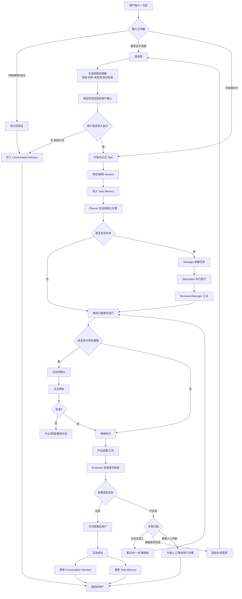

# AI Assistant：在保留现有架构下补回“对话感”的实施说明

## 目标

在 **不推翻现有任务执行架构**（Task / Session / Planner / Worker / Approval / Evaluator / Audit）的前提下，补齐“像在和人聊天”一样的交互体验。

当前系统已经比较适合：

- 接收自然语言任务
- 生成结构化步骤
- 执行工具
- 进入审批
- 中断 / 恢复 / 重试
- 记录审计与状态

但它还不够适合：

- 闲聊式往返
- 临时改口
- 轻量澄清
- 不进入正式任务的讨论
- 像 ChatGPT 一样自然的多轮对话

因此，这次改造的核心不是重写底层，而是在现有主链前后补两层：

1. **前置轻对话层**：先判断这句话该不该进任务系统
2. **后置交付层**：让结果像对话一样自然返回，而不是只像系统状态

---

## 设计原则

### 1. 默认先轻后重

不是每句话都应该创建正式任务。

优先级应该是：

1. 能直接回复，就直接回复
2. 需要澄清，就先澄清
3. 明确要执行，再创建正式任务

### 2. 对话状态和任务状态分开

“用户刚改了说法”和“任务真的要改执行路径”不是一回事。

必须区分：

- **Conversation Memory**：最近几轮说了什么、语气、偏好、改口、补充说明
- **Task Memory**：任务目标、约束、状态、工件、审批、执行结果

### 3. 保留现有治理能力

以下能力不能丢：

- 审批
- checkpoint
- interrupt / resume
- retry
- audit
- evaluator
- change / rollback

本次改造要做的是“让它更像助理”，不是“让它失去可控执行能力”。

---

## 总体方案

---

## 你要做的事情

## 第一阶段：加输入分流器

### 目标

不要让所有输入都直接进入 Task / Planner / Worker 主链。

### 要做什么

实现一个轻量入口判断器，把用户输入分成三类：

- **聊天类**：解释、改写、总结、追问、确认理解
- **澄清类**：任务不清楚，需要补充目标、约束、交付物、成功标准
- **执行类**：信息足够，可以创建正式任务

### 输出格式建议

分流结果至少包含：

- `mode`: `chat | clarify | execute`
- `reason`
- `confidence`
- `suggested_next_action`

### 验收标准

- 用户输入不会再“默认直接创建任务”
- 闲聊类输入能直接回复
- 模糊输入先进入澄清，不直接执行

---

## 第二阶段：加草稿态对话层

### 目标

正式执行前，先让系统用自然语言说清楚“它理解了什么、准备怎么做”。

### 要做什么

新增一个 **草稿态执行对象**，不要直接落成正式任务。草稿态至少包含：

- 目标
- 交付物
- 约束
- 未知项
- 风险点
- 成功标准
- 推荐执行方式

系统先回给用户：

- “我理解你的目标是……”
- “我准备这样做……”
- “以下几点我还不确定……”
- “如果你确认，我就开始执行。”

### 验收标准

- 用户能先讨论计划，再决定是否执行
- 草稿态不进入重型 worker 链路
- 草稿态可一键升级为正式任务

---

## 第三阶段：拆分 Conversation Memory 和 Task Memory

### 目标

防止对话被任务状态污染，也防止任务被闲聊噪音污染。

### 要做什么

建立两套记忆：

### Conversation Memory

保存：

- 最近几轮对话
- 用户刚刚改口的内容
- 语气与表达偏好
- 当前讨论中的临时限制

### Task Memory

保存：

- 正式任务目标
- 约束
- 已完成步骤
- 工件
- 审批记录
- 执行结果
- 失败点

### 验收标准

- 用户说“不是这个意思”时，可以只修正对话理解
- 不会立刻污染正式任务状态
- 进入正式执行时，再把有效约束写入 Task Memory

---

## 第四阶段：增加 Fast Path

### 目标

让简单问题不必走 Task / Queue / Worker / Approval 全链路。

### 适合走 Fast Path 的请求

- 纯解释
- 纯改写
- 纯总结
- 简单问答
- 无副作用的轻量分析

### 不适合走 Fast Path 的请求

- 需要调用工具
- 会改文件
- 会发请求
- 会产生外部副作用
- 需要审批
- 需要持久状态

### 验收标准

- 轻量交互响应更快
- 小问题不再显得“像执行一个任务”
- 有副作用时仍会自动切回正式链路

---

## 第五阶段：把审批体验改成“先自然语言确认，再正式审批”

### 目标

减少系统式打断感。

### 要做什么

当前高风险动作仍然必须审批，但在正式审批前，先对话式说明：

- 我将做什么
- 会产生什么影响
- 是否可回滚
- 为什么需要你确认

例如：

> 我可以帮你修改这个文件，这会覆盖原内容。确认后我再正式执行。

用户同意后，再进入正式审批记录。

### 验收标准

- 审批依旧保留
- 但用户主观感受更像“助理先口头确认”
- 而不是“系统突然弹审批卡住对话”

---

## 第六阶段：前置轻量 evaluator

### 目标

让系统在回复前先判断“这轮该不该执行、该不该追问、有没有理解错”。

### 要做什么

在正式 evaluator 之外，加一个轻量对话级 evaluator，用来判断：

- 这轮是否理解偏了
- 是否过早进入执行模式
- 是否应该先提问
- 是否只该给解释，不该落任务

### 验收标准

- 降低误执行概率
- 降低“你怎么又开始做了，我只是问问”的情况
- 提升自然对话感

---

## 第七阶段：支持“暂停任务，继续聊天”

### 目标

利用现有 interrupt / resume 能力，把它变成用户可感知的对话体验。

### 要做什么

允许系统在对话里明确表达：

- 我先暂停当前执行
- 我们先把目标对齐
- 你确认后我再继续

这样任务和对话可以来回切换，而不是一旦进入任务态就只能靠系统状态机推进。

### 验收标准

- 执行中的任务可自然回到讨论态
- 用户改口后体验更顺
- resume 时仍能衔接原来的 task state

---

## 第八阶段：重做 UI 视图优先级

### 目标

让产品看起来像“会话优先”，不是“任务面板优先”。

### 要做什么

UI 层建议改成：

- 主视图显示会话流
- 任务以卡片形式嵌在会话里
- 审批、步骤、checkpoint、评估作为展开信息
- 不是默认把用户带到任务后台视角

### 验收标准

- 用户第一感知是“我在和助理交流”
- 不是“我在操作任务系统”
- 底层架构不变，但产品感受明显改善

---

## 优先级建议

如果时间有限，先只做下面三个：

### P0

1. 输入分流器
2. 草稿态对话层
3. Conversation Memory / Task Memory 拆分

### P1

4. Fast Path
5. 对话式审批前确认
6. 轻量 evaluator

### P2

7. 暂停任务继续聊天
8. 会话优先 UI

---

## 最终目标

改造完成后，系统应该表现成这样：

- 用户随口一句话，不会总被当成执行命令
- 模糊需求会先被澄清
- 用户可以先讨论方案，再决定是否执行
- 简单问题能快速回复
- 高风险行为仍保留审批
- 执行系统依然可恢复、可审计、可回滚
- 整体体验从“系统在跑任务”变成“助理先聊天，再办事”

---

## 一句话总结

**不要把现有系统改成聊天机器人。**

应该做的是：

**在现有强执行底座外，补一层轻量会话操作系统。**

让它先像人一样交流，再像系统一样执行。
