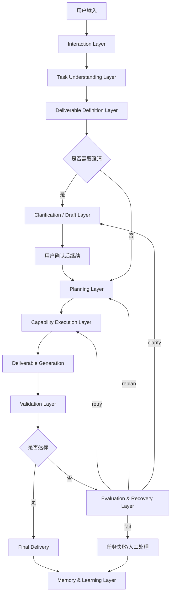

# 项目设计文档：面向模糊指令的通用任务架构

## 1. 背景与问题定义

当前系统已经具备较强的任务执行底座能力，典型能力包括：

- Web / CLI / API 入口
- Session / State / Review / Memory
- Planner / Worker 执行链路
- Tool Calling
- Approval / Risk Policy
- Retry / Interrupt / Resume
- Checkpoint / Audit
- Evaluator / Workflow Proposal / Change / Rollback

这套架构适合“可控执行”，但在面对模糊自然语言任务时，仍存在明显缺口：

### 1.1 当前问题

用户输入往往是模糊的，例如：

- 帮我找几个小红书文案
- 帮我整理一版面试自我介绍
- 调研下竞品，给我一个简表
- 给我几条适合发给客户的回复

系统当前容易出现以下问题：

1. **把任务理解成调研，而不是交付**
   - 搜索完成后给出趋势总结
   - 没有产出用户真正想要的最终结果

2. **中间结果冒充最终结果**
   - 输出搜索摘要、规划步骤、通用模板
   - 但没有完成最终交付物

3. **完成标准不明确**
   - 系统认为“执行结束”就是“任务完成”
   - 实际上用户想要的是“一个可直接使用的产物”

4. **不同任务缺少统一的抽象层**
   - 一旦遇到新型模糊任务，就需要打补丁
   - 任务类型越多，系统越容易演化成大量特判

### 1.2 核心结论

问题的本质不是“模型不会做”，而是系统缺少一条稳定的交付闭环：

**用户输入 → 理解任务 → 定义交付物 → 规划执行 → 生成结果 → 校验结果 → 返工/澄清 → 最终交付**

因此，本设计文档提出一套通用任务架构，用于支持模糊指令的稳定处理，而不是为每一类任务单独添加规则。

---

## 2. 设计目标

### 2.1 总体目标

在不推翻现有执行底座的前提下，将系统升级为：

- 能理解模糊指令
- 能明确最终交付物
- 能根据任务类型自动选择执行路径
- 能在输出不满足要求时自动返工或回到澄清
- 能持续从历史任务中沉淀高价值模式

### 2.2 具体目标

1. 用统一的结构化对象表达任务理解结果
2. 用统一的交付物定义表达“用户想要什么”
3. 用统一的计划模板表达“系统应该怎么做”
4. 用统一的校验器判断“任务是不是真的完成了”
5. 用统一的恢复动作处理失败和不达标输出
6. 用统一的记忆层沉淀模式，而不是保存杂乱日志

---

## 3. 设计原则

### 3.1 先定义交付物，再规划执行

系统必须先明确“最终要交什么”，再决定“如何执行”。

### 3.2 执行完成不等于任务完成

任务是否完成，必须由交付物校验结果决定，而不是由 worker 是否跑完决定。

### 3.3 不为单一任务类型打补丁

系统不应对“写文案”“写邮件”“做表格”分别硬编码逻辑，而应该通过统一抽象层处理。

### 3.4 中间产物和最终产物分离

调研摘要、规划结果、草稿、最终交付物必须分层存储与展示。

### 3.5 默认轻量，必要时重型

简单对话或轻量任务不应默认进入完整任务执行链；只有明确需要工具、持久化、副作用或复杂规划时，才升级到正式任务链。

---

## 4. 总体架构



---

## 5. 分层架构设计

## 5.1 Interaction Layer

### 职责

- 接收用户输入
- 维护会话上下文
- 区分聊天、澄清、任务执行
- 展示草稿、任务状态和最终交付

### 目标

避免所有输入都直接进入 Task / Worker 主链。

### 输入

- user_input
- conversation_context
- current_session

### 输出

- normalized_user_request
- interaction_mode

---

## 5.2 Task Understanding Layer

### 职责

把自然语言输入转成结构化任务理解结果。

### 输出对象：`TaskIntent`

```ts
export type TaskIntent = {
  taskType:
    | "qa"
    | "research"
    | "content_generation"
    | "rewrite"
    | "planning"
    | "execution"
    | "mixed";
  domain?: string;
  needsResearch: boolean;
  needsTools: boolean;
  needsClarification: boolean;
  ambiguityLevel: "low" | "medium" | "high";
  userGoal: string;
  deliveryMode: "direct_answer" | "artifact" | "table" | "structured_bundle";
};
```

### 示例

用户输入：`帮我找几个小红书文案`

```json
{
  "taskType": "content_generation",
  "domain": "social_media",
  "needsResearch": true,
  "needsTools": false,
  "needsClarification": false,
  "ambiguityLevel": "medium",
  "userGoal": "获得几个符合小红书风格、可直接使用的文案",
  "deliveryMode": "structured_bundle"
}
```

---

## 5.3 Deliverable Definition Layer

### 职责

将“用户真正想要的结果”结构化定义出来。

### 输出对象：`DeliverableSpec`

```ts
export type DeliverableSpec = {
  deliverableType: string;
  count?: number;
  format: "markdown" | "json" | "table" | "text";
  fields?: string[];
  constraints?: string[];
  successCriteria?: string[];
};
```

### 示例

```json
{
  "deliverableType": "copywriting_bundle",
  "count": 5,
  "format": "markdown",
  "fields": ["title", "body", "style", "scenario"],
  "constraints": ["可直接复制使用", "风格符合小红书", "内容不重复"],
  "successCriteria": ["至少5条", "每条包含标题和正文", "不是摘要而是成品"]
}
```

### 设计意义

这层是整个方案的核心。系统必须先知道：

- 要交什么
- 交几个
- 用什么格式
- 满足哪些质量要求

没有这层，系统就容易把中间摘要误交给用户。

---

## 5.4 Clarification / Draft Layer

### 职责

当任务目标、约束、交付物不清晰时，不直接创建正式任务，而是先生成草稿理解并向用户确认。

### 草稿内容建议

- 我理解你的目标是……
- 我准备产出的结果是……
- 我还不确定的点是……
- 如果你确认，我将开始执行

### 输出对象：`ClarificationDraft`

```ts
export type ClarificationDraft = {
  interpretedGoal: string;
  proposedDeliverable: DeliverableSpec;
  openQuestions: string[];
  recommendedPlanType: string;
};
```

### 设计意义

避免系统在信息不足时过早进入重链路。

---

## 5.5 Planning Layer

### 职责

根据 `TaskIntent + DeliverableSpec` 生成交付导向的执行计划。

### 输出对象：`ExecutionPlan`

```ts
export type ExecutionPlan = {
  planType:
    | "direct_answer"
    | "research_then_answer"
    | "research_then_generate"
    | "tool_execution"
    | "clarify_first";
  steps: PlanStep[];
};

export type PlanStep = {
  id: string;
  kind:
    | "clarify"
    | "research"
    | "extract"
    | "synthesize"
    | "generate"
    | "validate"
    | "deliver";
  tool?: string;
  inputRef?: string[];
  outputKey: string;
};
```

### 示例

```json
{
  "planType": "research_then_generate",
  "steps": [
    {"id":"s1","kind":"research","tool":"web_search","outputKey":"search_results"},
    {"id":"s2","kind":"synthesize","outputKey":"style_patterns"},
    {"id":"s3","kind":"generate","outputKey":"deliverable_draft"},
    {"id":"s4","kind":"validate","outputKey":"validation_report"},
    {"id":"s5","kind":"deliver","outputKey":"final_answer"}
  ]
}
```

### 设计要求

- planner 必须显式消费 `DeliverableSpec`
- 计划必须包含 `generate` 和 `validate`，不能只停在 `research`
- 计划模板优先于自由生成，降低漂移

---

## 5.6 Capability Execution Layer

### 职责

复用现有运行时底座执行具体能力。

### 可复用能力

- Worker
- Tool Calling
- Approval
- Retry
- Interrupt / Resume
- Checkpoint
- Audit
- Multi-agent runtime

### 节点分类建议

1. **Data Acquisition Nodes**
   - web_search
   - file_read
   - http_request
   - db_query

2. **Transformation Nodes**
   - summarize
   - extract
   - normalize
   - structure

3. **Deliverable Nodes**
   - generate_copy
   - generate_email
   - generate_table
   - render_markdown

### 设计要求

系统必须显式区分“取数据”和“产出交付物”，避免 acquisition 结束后直接收口。

---

## 5.7 Deliverable Generation

### 职责

根据前面的调研、提炼结果，生成最终草稿交付物。

### 输出对象

- deliverable_draft
- artifact_bundle

### 设计要求

- 必须严格遵守 `DeliverableSpec`
- 结果必须是可直接交付给用户的产物，而不是中间分析说明
- 建议支持结构化输出到 markdown / json / table

---

## 5.8 Validation Layer

### 职责

判断输出是否真的满足交付要求。

### 输出对象：`ValidationReport`

```ts
export type ValidationReport = {
  isValid: boolean;
  score: number;
  issues: string[];
  retryable: boolean;
  suggestedAction?: "retry" | "replan" | "clarify" | "fail";
};
```

### 校验类型

#### 结构校验

- 数量是否满足要求
- 字段是否完整
- 格式是否符合定义

#### 语义校验

- 是否满足用户目标
- 是否是成品而不是摘要
- 是否可直接使用

### 设计建议

先从规则校验开始，再引入 LLM evaluator。

---

## 5.9 Evaluation & Recovery Layer

### 职责

根据 `ValidationReport` 决定下一步动作。

### 输出对象：`RecoveryAction`

```ts
export type RecoveryAction = {
  action: "retry" | "replan" | "clarify" | "fail";
  reason: string;
};
```

### 行为说明

- `retry`：输出不合格，但计划合理，重新生成
- `replan`：计划本身有问题，重新规划
- `clarify`：缺关键约束，回到用户澄清
- `fail`：不可恢复，进入人工处理

### 设计目标

让系统形成闭环，而不是在错误位置停下。

---

## 5.10 Memory & Learning Layer

### 职责

沉淀高价值经验，而不是简单保存所有日志。

### 建议拆分为三类

#### Conversation Memory

- 近期对话
- 用户偏好
- 语气和表达风格
- 临时约束

#### Task Memory

- 任务目标
- 计划
- 步骤结果
- 工件
- 审批记录
- 失败点

#### Pattern Memory

- 某类任务常用交付物定义
- 某类任务常见失败模式
- 某类任务高成功率计划模板

### 设计目标

真正支持通用化的不是大量会话历史，而是可复用的任务模式。

---

## 6. 运行时状态机

```text
NEW
-> UNDERSTOOD
-> DELIVERABLE_DEFINED
-> PLANNED
-> RUNNING
-> GENERATED
-> VALIDATING
-> COMPLETED
```

失败分支：

```text
VALIDATING
-> RETRYING
-> REPLANNING
-> WAITING_CLARIFICATION
-> FAILED
```

### 状态含义

- `UNDERSTOOD`：已生成 TaskIntent
- `DELIVERABLE_DEFINED`：已生成 DeliverableSpec
- `PLANNED`：已生成 ExecutionPlan
- `RUNNING`：执行计划中
- `GENERATED`：已得到交付物草稿
- `VALIDATING`：正在校验结果
- `COMPLETED`：最终交付成功

---

## 7. 数据模型建议

建议新增或扩展如下数据结构：

## 7.1 tasks

新增字段：

- `task_intent_json`
- `deliverable_spec_json`
- `execution_plan_json`
- `validation_report_json`
- `recovery_action_json`
- `final_deliverable_path`

## 7.2 artifacts

建议分层：

- `research_notes`
- `plan`
- `deliverable_draft`
- `validation_report`
- `final_answer`

## 7.3 pattern_memory

建议新增表：

- `pattern_type`
- `domain`
- `task_type`
- `deliverable_template`
- `plan_template`
- `failure_pattern`
- `success_rate`

---

## 8. 示例：以“小红书文案”任务说明运行路径

### 输入

`帮我找几个小红书文案`

### TaskIntent

```json
{
  "taskType": "content_generation",
  "domain": "social_media",
  "needsResearch": true,
  "needsTools": false,
  "needsClarification": false,
  "ambiguityLevel": "medium",
  "userGoal": "获得几个符合小红书风格、可直接使用的文案",
  "deliveryMode": "structured_bundle"
}
```

### DeliverableSpec

```json
{
  "deliverableType": "copywriting_bundle",
  "count": 5,
  "format": "markdown",
  "fields": ["title", "body", "style"],
  "constraints": ["可直接复制", "风格多样", "符合小红书语感"],
  "successCriteria": ["至少5条", "每条包含标题和正文", "不是摘要而是成品"]
}
```

### ExecutionPlan

```json
{
  "planType": "research_then_generate",
  "steps": [
    {"id":"s1","kind":"research","tool":"web_search","outputKey":"search_results"},
    {"id":"s2","kind":"synthesize","outputKey":"style_patterns"},
    {"id":"s3","kind":"generate","outputKey":"deliverable_draft"},
    {"id":"s4","kind":"validate","outputKey":"validation_report"},
    {"id":"s5","kind":"deliver","outputKey":"final_answer"}
  ]
}
```

### Validation Rules

- 是否至少生成 5 条文案
- 每条是否包含标题和正文
- 是否属于小红书语感
- 是否是可直接使用的文案，而不是趋势总结

如果失败，则：

- 优先 `retry generate`
- 再失败则 `replan`
- 若约束不明则 `clarify`

---

## 9. 实施规划

## Phase 1：任务理解与交付物定义

### 目标

把“用户输入”升级为：

- `TaskIntent`
- `DeliverableSpec`

### 工作内容

1. 新增 `TaskIntentResolver`
2. 新增 `DeliverableSpecResolver`
3. 修改任务创建流程，持久化这两个对象
4. Web/CLI 增加显示能力

### 验收标准

- 系统可区分问答、调研、内容生成、改写、执行、混合任务
- 对常见任务能给出合理 DeliverableSpec

---

## Phase 2：交付导向 Planner

### 目标

让 planner 围绕交付物做计划，而不是围绕工具做计划。

### 工作内容

1. 引入 plan archetypes
2. planner 输入显式包含 DeliverableSpec
3. 强制增加 `generate` 和 `validate` 节点
4. 拆分中间产物与最终产物

### 验收标准

- research 型任务不会在 research 后直接结束
- content_generation 型任务必须经过 generate_deliverable

---

## Phase 3：Validator 与 Recovery

### 目标

阻止中间结果冒充最终交付。

### 工作内容

1. 增加规则校验器
2. 增加语义 evaluator
3. 接入 retry / replan / clarify
4. 任务完成判定改由 validation 结果驱动

### 验收标准

- 可阻止数量不足、格式错误、给摘要不给成品等问题
- 不合格任务不会直接进入 completed

---

## Phase 4：模式沉淀与持续优化

### 目标

提升通用任务处理能力，而不是继续堆特判。

### 工作内容

1. 沉淀失败模式
2. 沉淀成功模板
3. 引入离线评测集
4. 用任务类型 + 交付物类型衡量成功率

### 验收标准

- 相似任务命中历史高成功率 plan 时表现更稳定
- 新任务出现时不必快速手工补丁

---

## 10. MVP 范围建议

建议先做最小闭环：

```text
user_input
-> infer_task_intent
-> infer_deliverable_spec
-> build_plan_template
-> execute
-> generate_deliverable
-> validate_output
-> if fail retry once
-> final_answer
```

### MVP 目标

先解决“系统能不能稳定交付用户真正要的东西”。

不要在 MVP 阶段优先做：

- 复杂多 agent 自动协作
- 自修改
- 自动 workflow 优化
- 高级记忆策略

这些都应建立在交付闭环已经成立之后。

---

## 11. 风险与注意事项

### 11.1 过度依赖 LLM 自由发挥

如果关键对象仍是自由文本，系统会继续漂移。必须尽快把 TaskIntent / DeliverableSpec / ValidationReport 结构化。

### 11.2 planner 不消费交付物定义

如果 planner 看不到 DeliverableSpec，仍会优先走“搜一下、总结一下”的路径。

### 11.3 validator 太弱

如果只做结构校验，不做语义校验，系统仍可能输出“看起来格式对，但内容不是用户想要的东西”。

### 11.4 产物不分层

如果 research notes、deliverable draft、final answer 混在一起，系统很容易把中间层交付出去。

---

## 12. 成功指标

建议建立以下指标：

### 12.1 任务交付成功率

用户目标真正达成的比例，而不是任务执行结束比例。

### 12.2 一次通过率

无需 retry / replan / clarify 的直接完成比例。

### 12.3 中间结果误交率

中间摘要、规划结果、研究笔记被误当成最终交付的比例。

### 12.4 澄清命中率

需要澄清的任务是否在执行前被拦住，而不是执行后才暴露问题。

### 12.5 模式复用成功率

使用历史高成功率模板后，是否真的提升成功率。

---

## 13. 结论

本方案的核心，不是为每类任务添加补丁，而是引入四个统一对象：

- `TaskIntent`
- `DeliverableSpec`
- `ExecutionPlan`
- `ValidationReport`

让系统围绕这四个对象形成统一运行时闭环。

这样无论用户输入的是：

- 帮我找几个小红书文案
- 给我写一封道歉邮件
- 帮我做个竞品对比表
- 帮我整理一版面试自我介绍

系统都先回答两件事：

1. 用户真正想要的结果是什么？
2. 为了交付这个结果，最可靠的路径是什么？

只有这样，系统才会从“可控执行平台”进一步升级成“能接住模糊目标并稳定交付的助理系统”。

